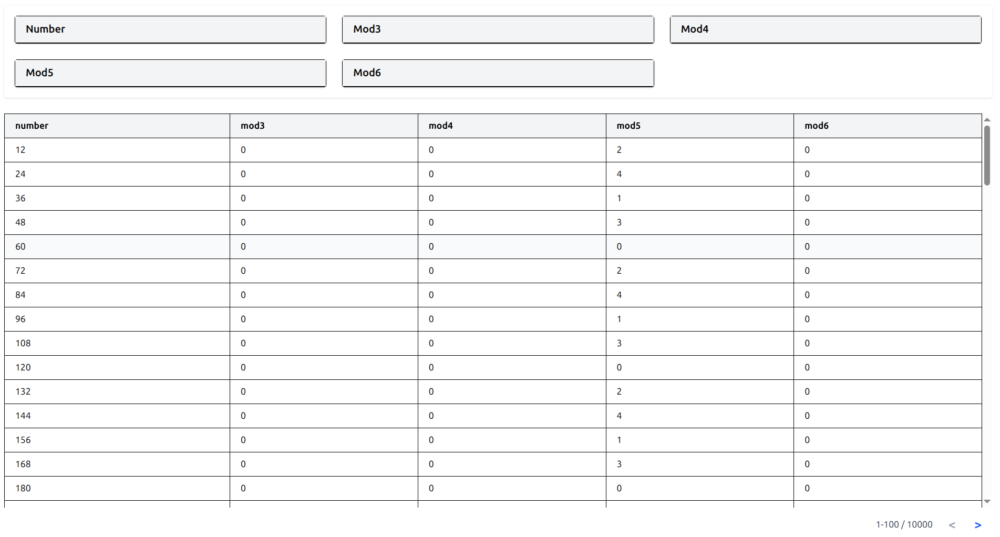

# Project Name

A React + TypeScript project supporting pagination, scrolling, and state management using React Context.

---

## Tech Stack

- React 19 (with TypeScript)
- Node.js backend (assumed from `npm run dev` command)
- React Context for state management (bookmark management)
- Jest for unit testing

---

## Features

- Pagination and infinite scrolling support
- Independent error handling at component level
- State management using React Context (Redux can be integrated if needed)
- Performance optimizations considered
- Strictly typed with TypeScript
- Configurable and reusable components
- Well-structured, consistent naming conventions
- Unit test coverage for key functionalities

---

## Getting Started

### Prerequisites

- Node.js (v14+ recommended)
- npm (v6+ recommended)

---

### Setup & Run Backend

```bash
cd backend
npm run dev


cd frontend

npm run dev


